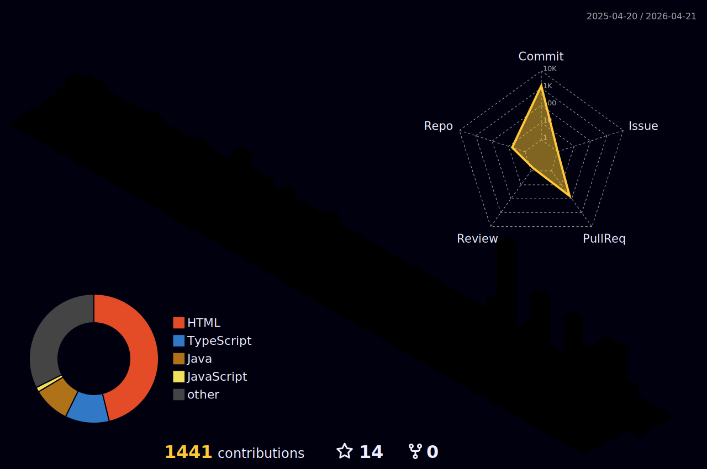

<a href="https://xeunnie.github.io/portfoliopage/">click this to see my portfolio page</a>

🔭 I’m currently working on React.ts
🌱 I’m currently learning web front-end

<b>About Designs</b> 
     

<b>About Video Editing</b> 
 

<b>Game Engineering</b> 

<b>Publishing</b> 
  

<b>Front-end Developing</b> 
    
 
  

  

