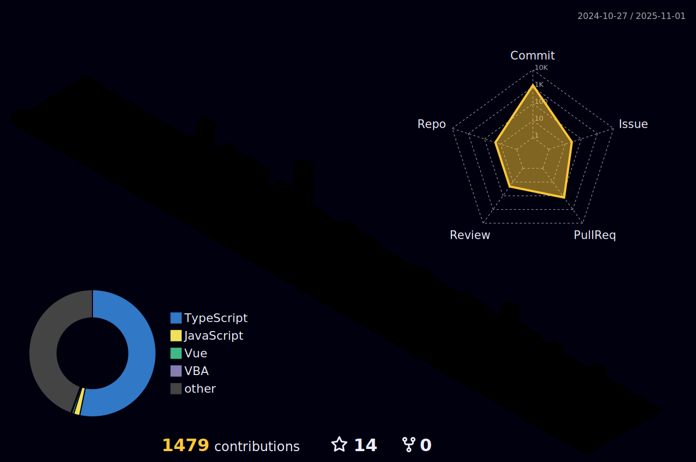

# 👩‍💻Introduce
<b>프론트엔드 개발자 최승은입니다.</b>
 
 
## 💻 Now
 
🔭 Frontend 

  
  
 

## 🤓 Education

🫠Ajou University Majored in Digital Media 🮠and English 📓

🏛️ HanHwa System Byond SW Camp 6th Back-end Track (2024.04.29 ~ 2024.10.25)💻

 

## 🚀 My Core Skill Set

### ⚛️ Frameworks
 
 
 

### 📊 State Management

### 🔎 Performance & UI/UX Testing
 
 
 
 
 

### 📦 Backend & DevOps

 

### 💽  Database

 

### 🌐 Cloud & Containerization
 

 

## 🖥 Commit Records

 
 
 

